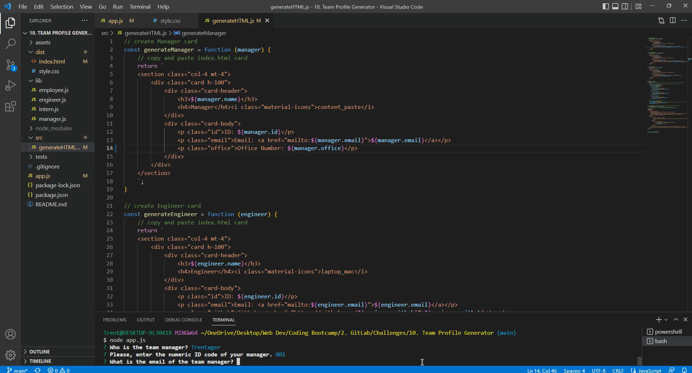
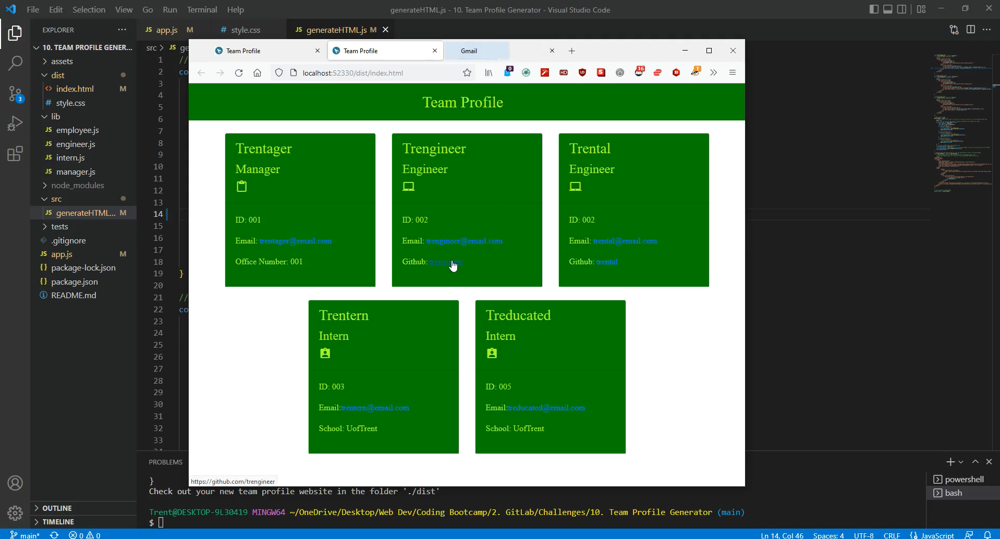
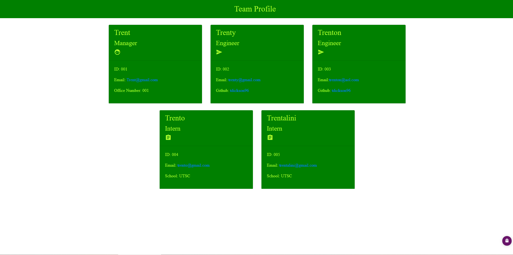

# Team-Profile Website Generator

    Node and Inquirer project that will take  your team name and information.

---
## Table of Contents

1. [About!](#about)

    a. [Story](#story)

    b. [Criteria](#criteria)

    c. [Technology](#technology)
    
2. [Install](#install)
3. [Licence](#licence)
4. [Contribution](#contribution)
5. [Tests](#tests)
6. [Authors](#authors)

---
## About 

    Creating a webpage with the basic information of your professional work team. Runs using Node and Inquirer. Test with Jest. Uses Bootstrap and jQuery. 

---
## Story

    As a team lead, I wanted to develop basic informational cards on my employees that I can share with other professions and add to our client website.

---
## Video Walkthrough

[Running the application in the command-line](https://drive.google.com/file/d/148mM57cIo2JbZg_ySWyfJPOXeA34E0jv/view)

[Running the tests in the command-line with Jest](https://drive.google.com/file/d/1cxNUjwfQvZp1Aef_nDV7VGW-vusRt9Hp/view)

---
## Technology

    Node
    Inquirer
    Jest
    JavaScript
    jQuery
    Bootstrap
    Materials Icons

---
## Install

    Clone the repository, Node.js installed, install dependencies ("npm install"), and in command-line type "node app.js"

    Clone the repository:

        git clone https://github.com/tdickson96/Team-Profile-Generator

---
## Licence

    Licence used: MIT

---
## Contribution

    If you would like to learn how to assist or contribute to this project:
        - Fork the repository
        - Create a feature branch (git checkout -b NAME)
        - Commit your new feature (git commit -m "feature")
        - Push your feature branch (git push)
        - Create a new pull request

---
## Tests

    Four test suites with test cases in './test' folder powered by Jest.
    "npm install"
    "npm test"
    Test video: https://drive.google.com/file/d/1cxNUjwfQvZp1Aef_nDV7VGW-vusRt9Hp/view 

---
## Authors

    Trent Dickson

---
## Contact

> GitHub username: tdickson96
> Contact email: trentdickson22@gmail.com

---
## Special Thanks

    Nicole Wallace: https://github.com/nicolewallace09/team-profile-generator 
    Ryan Ellingson: https://github.com/RyanEllingson/Team-Profile-Generator 
    John Vayianos: https://codetea.com/team-profile-generator-with-javascript/ 

